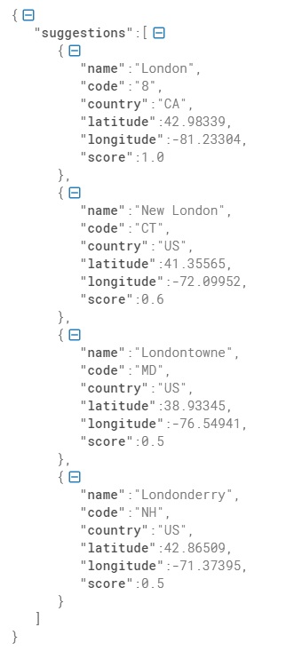

# REST API
Auto-complete suggestions for large cities.

## Consumo de Servicio
Se tienen varios parámetros con los que podemos realizar las búsquedas, aunque solo 1 es obligatorio.

- **q:** Termino del nombre de la ciudad a buscar, este puede ser completo o parcial _**Este parámtero es obligatorio**_.
- **latitude:** Latitud de la ciudad a buscar _**Este parámtero es opcional**_.
- **longitude:** Longitud de la ciudad a buscar _**Este parámtero es opcional**_.
- **flag:** Valor entre 0 y 1. Este valor se utiliza cuando se ponen todos los parámetros anteriores y se quiere priorizar los resultados por **latitud(0)** o por
  la **longitud(1)**. _**Este parámtero es opcional y funciona solo cuando se pasan todos los demás parámetros**_.

La URL de despliegue es: `https://api-rest-bch.uc.r.appspot.com`.

Las formas de acceder al servicio son a partir del endpoint `/suggestions` seguido de los parámetros antes mencionados:

* **q**: `https://api-rest-bch.uc.r.appspot.com/suggestions?q=RandomCity`
* **q** y **latitude**: `https://api-rest-bch.uc.r.appspot.com/suggestions?q=RandomCity&latitude=45.23456`
* **q** y **longitude**: `https://api-rest-bch.uc.r.appspot.com/suggestions?q=RandomCity&longitude=-75.23456`
* **q**, **latitude** y **longitude**: `https://api-rest-bch.uc.r.appspot.com/suggestions?q=RandomCity&latitude=45.23456&longitude=-75.23456`
* **q**, **latitude**, **longitude** y **flag**: `https://api-rest-bch.uc.r.appspot.com/suggestions?q=RandomCity&latitude=45.23456&longitude=-75.23456&flag=[0-1]`

El JSON que regresa contiene los siguientes valores:

* **name**: Nombre de la ciudad.
* **code**: Código del Estado en que se encuentra la ciudad.
* **country**: País en que se encuentra la ciudad.
* **latitude**: Latitud de la ciudad.
* **longitude**: Longitud de la ciudad.
* **score**: Score que indica que tan confiable es la sugerencia.

El orden de las sugerencias es en base al valor de **score**. Este valor se calcula dependiendo de los parámetros que se pasen.

- La búsqueda con el páramtro obligatorio **q**, nos mostrará las sugerencias que hagan mejor match entre **q** y el nombre de la ciudad.
- Si a la búsqueda se le agrega el parámetro **latitude**, las sugerencias se basaran en las ciudades que tengan como nombre el término pasado **q** pero que 
  tengan una **latitude** menor a la que se esta pasando en el parámetro **latitude**.
- Si a la búsqueda se le agrega el parámetro **longitude**, las sugerencias se basaran en las ciudades que tengan como nombre el término pasado **q** pero que 
  tengan una **longitude** mayor (ya que son números negativos) a la que se esta pasando en el parámetro **longitude**.
- Si la búsqueda se realiza con todos los términos (q, latitude y longitude) por defecto nos mostrará las sugerencias que hagan mejor match entre **q** y el 
  nombre de la ciudad y que sus latitudes y longitudes esten en el rango de valores que se pasan en **latitude** y **longitude** en este caso el score se calcula
  en base a las ciudades que hagan mejor match con **q**.
- Si a la búsqueda con todos los términos se quiere priorizar las sugerencias que hagan mejor match con **latitude** o **longitude** se tiene que poner el parámetro
  **flag**, si el valor es 0 se prioriza por **latitude** y si el valor es 1 se prioriza por **longitude**

## Ejemplos
`curl -v "https://api-rest-bch.uc.r.appspot.com/suggestions?q=For"`

`curl -v "https://api-rest-bch.uc.r.appspot.com/suggestions?q=For&latitude=45.76356"`

`curl -v "https://api-rest-bch.uc.r.appspot.com/suggestions?q=For&longitude=-75.78256"`

`curl -v "https://api-rest-bch.uc.r.appspot.com/suggestions?q=For&latitude=45.76356&longitude=-75.78256"`

`curl -v "https://api-rest-bch.uc.r.appspot.com/suggestions?q=For&latitude=45.76356&longitude=-75.78256&flag=0"`

`curl -v "https://api-rest-bch.uc.r.appspot.com/suggestions?q=For&latitude=45.76356&longitude=-75.78256&flag=1"`

